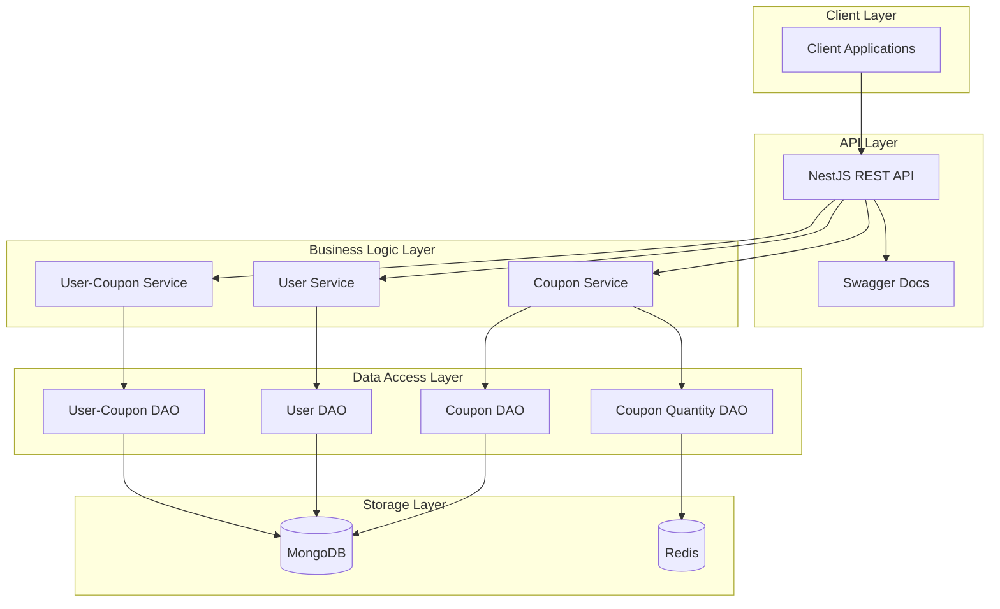

# Coupon System

> **동시성을 고려한 쿠폰 발급 시스템**


## 프로젝트 소개

**Coupon System**은 대규모 트래픽 환경에서 안정적인 쿠폰 발급 및 관리를 위해 설계된 백엔드 시스템입니다. 
MongoDB와 Redis를 활용한 하이브리드 데이터 저장소 아키텍처를 통해 데이터 일관성과 성능을 동시에 확보했습니다.

### 중요 페이지
- API 문서: https://doroks.tplinkdns.com/couponsystem/back/docs
- API 테스트 페이지: https://doroks.tplinkdns.com/couponsystem/front

### 주요 특징

- **고성능 쿠폰 발급**: Redis를 활용한 빠른 재고 관리 및 동시성 제어
- ~~**데이터 일관성**: MongoDB 트랜잭션과 보상 트랜잭션을 통한 데이터 무결성 보장~~
- **확장 가능한 아키텍처**: NestJS 모듈 시스템을 활용한 마이크로서비스 지향 설계
- **실시간 모니터링**: Swagger API 문서화 및 로깅 시스템
- **타입 안정성**: TypeScript 기반 End-to-End 타입 안정성

## 시스템 아키텍처



## 프로젝트 구조

```
src/
├── common/                 # 공통 모듈 (필터, 인터셉터)
├── coupon/                 # 쿠폰 관리 모듈
│   ├── dao/               # 데이터 액세스 계층
│   ├── dto/               # 데이터 전송 객체
│   ├── exception/         # 예외 처리
│   └── schema/            # MongoDB 스키마
├── user/                   # 사용자 관리 모듈
├── user-coupon/           # 쿠폰 발급 관리 모듈
├── log/                   # 로깅 미들웨어
└── main.ts                # 애플리케이션 진입점
```

## 기술 스택

### Backend Framework
- **NestJS 11.x**: 엔터프라이즈급 Node.js 프레임워크
- **TypeScript 5.7**: 정적 타입 검사 및 최신 ECMAScript 지원

### Database & Storage
- **MongoDB 8.x**: 메인 데이터 저장소 (쿠폰, 사용자, 발급 이력)
- **Redis 5.x**: 쿠폰 재고 관리 및 고성능 캐싱
- **Mongoose**: MongoDB ODM 및 스키마 관리

### DevOps & Tools
- **Swagger**: API 문서화 및 테스팅
- **Jest**: 단위 테스트 및 통합 테스트
- **Docker**: 컨테이너화 (추가 예정)

## 주요 기능

### 1. 쿠폰 관리
- **쿠폰 생성**: 유효기간, 수량 제한이 있는 쿠폰 생성
- **쿠폰 조회**: 개별/목록 조회 및 실시간 재고 확인
- **재고 관리**: Redis 기반 원자적 재고 차감

### 2. 사용자 관리
- **사용자 등록**: 개별 및 대량 사용자 생성
- **사용자 조회**: 사용자 정보 및 보유 쿠폰 조회

### 3. 쿠폰 발급 시스템
- **안전한 발급**: 동시성 제어를 통한 중복 발급 방지
- **실시간 재고 관리**: Lua 스크립트를 활용한 원자적 연산
- **발급 이력 관리**: 사용자별 쿠폰 발급 및 사용 이력 추적

## 📊 성능 최적화 전략

### 1. 데이터베이스 최적화
```typescript
// Redis Lua 스크립트를 활용한 원자적 재고 차감
const luaScript = `
  local key = KEYS[1]
  local current = redis.call('HGET', key, 'remainingCount')
  if not current then return 0 end
  
  local count = tonumber(current)
  if count > 0 then
    redis.call('HINCRBY', key, 'remainingCount', -1)
    return 1
  else
    return -1
  end
`;
```

## API 엔드포인트

### 쿠폰 관리
```http
GET    /coupons/:id          # 쿠폰 조회
GET    /coupons              # 쿠폰 목록 조회
POST   /coupons              # 쿠폰 생성
```

### 사용자 관리
```http
GET    /users/:id            # 사용자 조회
GET    /users                # 사용자 목록 조회
POST   /users                # 사용자 생성
POST   /users/random         # 대량 사용자 생성
```

### 쿠폰 발급
```http
POST   /user-coupons         # 쿠폰 발급
GET    /user-coupons/:userId # 사용자 쿠폰 조회
```

## 빠른 시작

### 1. 환경 설정
```bash
# 의존성 설치
npm install

# 환경변수 설정
cp env.example .env
```

### 2. 데이터베이스 설정
```bash
# MongoDB 실행 (Docker)
docker run -d --name mongodb -p 27017:27017 mongo:8

# Redis 실행 (Docker)
docker run -d --name redis -p 6379:6379 redis:7
```

### 3. 애플리케이션 실행
```bash
# 개발 모드
npm run start:dev

# 프로덕션 모드
npm run start:prod
```

### 4. API 문서 확인
브라우저에서 `http://localhost:3000/docs` 접속

## 🧪 테스트

```bash
# 단위 테스트
npm run test

# E2E 테스트
npm run test:e2e

# 테스트 커버리지
npm run test:cov
```


## 추가 개선사항
- [ ] DB 트랜잭션 추가 (mongo DB replica set 활성화)
- [ ] DB 쿼리 최적화